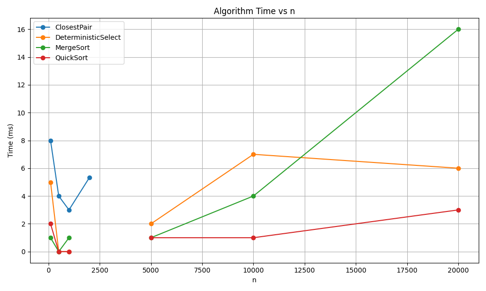
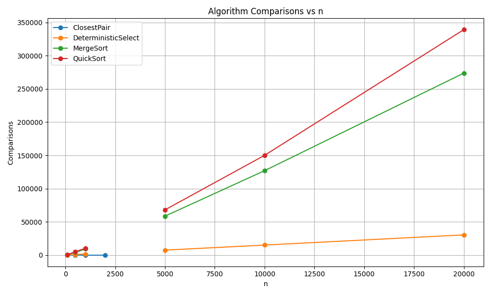
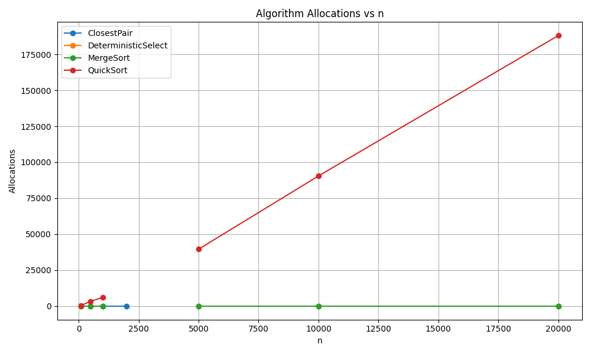

# Algorithms Project

## 1. Architecture Notes
This project implements classical algorithms with attention to **recursion depth and memory allocations**:

- **Mergesort** – recursive splitting with buffer reuse; switches to insertion sort for very small arrays to reduce allocations.
- **Quicksort** – always recurses on the smaller partition first to limit recursion depth; randomized pivot avoids worst-case inputs.
- **Selection (MoM5)** – deterministic median-of-medians; recursion controlled by grouping elements in 5s to guarantee linear time.
- **Closest Pair** – divide-and-conquer; checks points near the middle strip; recursion depth logarithmic.
- **Memory** – buffers reused, recursion depth is bounded, preventing stack overflow.

---

## 2. Recurrence Analysis

- **Mergesort**  
  Recurrence: `T(n) = 2T(n/2) + Θ(n)`  
  Using Master Theorem (case 2) → Θ(n log n). Balanced splitting ensures linear merge steps.

- **Quicksort (randomized)**  
  Recurrence: `T(n) = T(k) + T(n−k−1) + Θ(n)`  
  Expected Θ(n log n) using probabilistic analysis. Depth ≤ 2 log₂ n with high probability.

- **Selection (MoM5)**  
  Recurrence: `T(n) = T(n/5) + T(7n/10) + Θ(n)`  
  Akra–Bazzi method → Θ(n). Recursion reduces problem size deterministically for worst-case linear time.

- **Closest Pair**  
  Recurrence: `T(n) = 2T(n/2) + Θ(n)`  
  Same as mergesort, Θ(n log n). Merge step is linear due to strip checks.

---

## 3. Experimental Results & Plots

We collected three main metrics:

1. **Algorithm Time** – execution time in ms
2. **Algorithm Allocations** – number of memory allocations
3. **Algorithm Comparisons** – number of key comparisons

**Observations:**
- Mergesort & Quicksort scale as Θ(n log n); Quicksort slightly faster due to **cache effects**.
- Selection grows linearly, but constants are higher than normal quickselect.
- Closest Pair matches Θ(n log n), much faster than brute-force O(n²).
- Randomized pivots and JVM garbage collection affect constants.

**Plots:**

**Algorithm Time vs n**  
  
*Shows execution time growth with input size.*

**Algorithm Comparisons vs n**  
  
*Shows number of key comparisons per algorithm.*

**Algorithm Allocations vs n**  
  
*Shows memory allocation count per algorithm.*

---

## 4. Summary

- **Theory vs Measurements** – observed growth matches Θ-analysis.
- **Sorting** – both Mergesort and Quicksort Θ(n log n); Quicksort faster due to cache locality.
- **Selection (MoM5)** – worst-case linear time confirmed; constants bigger than randomized quickselect.
- **Closest Pair** – Θ(n log n) confirmed; huge speed-up over O(n²).
- **Conclusion** – asymptotic theory holds; constant factors (cache, pivot randomness, GC) explain differences.
